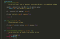
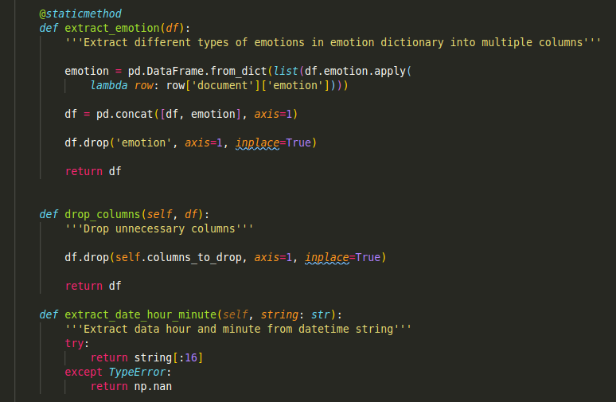
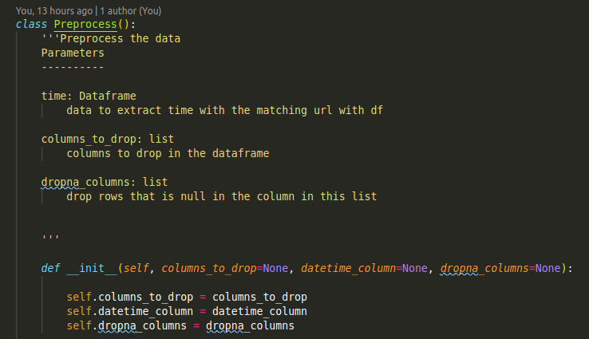
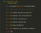
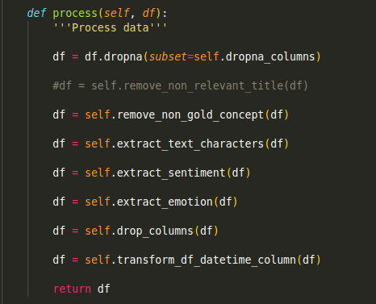

# 5 Reasons why you should Switch from Jupyter Notebook to Scripts

> Using Scripts Helps me Realize the Drawbacks of Jupyter Notebook

Opinion
-------

Using Scripts Helps me Realize the Drawbacks of Jupyter Notebook
----------------------------------------------------------------

Photo by [Luca Bravo](https://unsplash.com/@lucabravo?utm_source=medium&utm_medium=referral) on [Unsplash](https://unsplash.com/?utm_source=medium&utm_medium=referral)

Like most people, the first tool I used when started learning data science is Jupyter Notebook. Most of the online data science courses use Jupyter Notebook as a medium to teach. This makes sense because it is easier for beginners to start writing code in Jupyter Notebook’s cells than writing a script with classes and functions.

Another reason why Jupyter Notebook is such a common tool in data science is that Jupyter Notebook makes it easy to explore and plot the data. When we type ‘Shift + Enter’, we will immediately see the results of the code, which makes it easy for us to identify whether our code works or not.

However, I realized several fallbacks of Jupyter Notebook as I work with more data science projects:

*   **Unorganized**: As my code gets bigger, it becomes increasingly difficult for me to keep track of what I write. No matter how many markdowns I use to separate the notebook into different sections, the disconnected cells make it difficult for me to concentrate on what the code does.
*   **Difficult to experiment:** You may want to test with different methods of processing your data, choose different parameters for your machine learning algorithm to see if the accuracy increases. But every time you experiment with new methods, you need to find and rerun the related cells. This is confusing and time-consuming, especially when the processing procedure or the training takes a long time to run.
*   **Not ideal for reproducibility:** If you want to use new data with a slightly different structure, it would be difficult to identify the source of error in your notebook.
*   **Difficult to debug:** When you get an error in your code, it is difficult to know whether the reason for the error is the **code** or the change in **data**. If the error is in the code, which part of the code is causing the problem?
*   **Not ideal for production:** Jupyter Notebook does not play very well with other tools. It is not easy to run the code from Jupyter Notebook while using other tools.

I knew there must be a better way to handle my code so I decided to give scripts a try. To make it less confusing, I refer to .py file when using word “script” in this article. These are the benefits I found when using scripts:

The cells in Jupyter Notebook make it difficult to organize the code into different parts. With a script, we could create several small functions with each function specifies what the code does like this

Better yet, if these functions could be categorized in the same category such as functions to process the data, we could put them in the same class!

Whenever we want to process our data, we know the functions in the class `Preprocess` can be used for this purpose.

When we want to experiment with a different approach to preprocess data, we could just add or remove a function by commenting out like this without being afraid to break the code! Even if we happen to break the code, we know exactly where to fix it.

With classes and functions, we could make the code general enough so that it will be able to work with other data.

For example, if we want to drop different columns in my new data, we just need to change `columns_to_drop` to a list of columns, we want to drop and the code will run smoothly!

I can also create a [**pipeline**](https://medium.com/vickdata/a-simple-guide-to-scikit-learn-pipelines-4ac0d974bdcf) that specifies steps to process and train the data! Once I have a pipeline, all I need to do is to use

pipline.fit\_transform(data)

to apply the same processing to both the train and test data.

With functions, it is easier to test whether that function produces the output we expect. We can quickly spot out where in the code we should change to produce the output we want

If all of the tests pass but there is still an error in running our code, we know the data is where we should look next.

For example, after passing the test above, I still have a TypeError when running the script, which gives me the idea that my data has null values. I just need to take care of that to run the code smoothly.

We can use different functions in multiple scripts on top of something else like this

or to add a config file to control the values of the variables. This prevents us from wasting time tracking down a specific variable in the code just to change its value.

We could also easily add tools to track the experiment such as [MLFlow](https://mlflow.org/) or tools to handle configuration such as [Hydra.cc](https://hydra.cc/)!

I used to use Jupyter Notebook all the time. When some data scientists advise me to switch from Jupyter Notebook to script to prevent some problems listed above, I didn’t understand and felt resistant to do so. I didn’t like the uncertainty of not being able to see the outcome when I run the cell.

But the disadvantage of Jupyter Notebook grew as I started my first real data science project in my new company so I decided to push myself out of my comfort zone and experiment with scripts.

In the beginning, I felt uncomfortable but started to notice the benefits of using scripts. I started to feel more organized when my code is organized into different functions, classes, and into multiple scripts with each script serving different purposes such as preprocessing, training, and testing.

Don’t get me wrong. I still use Jupyter Notebook if my code is small and if I don’t plan to put my code into production. I use Jupyter Notebook when I want to explore and visualize the data. I also use it to explain how to use some python libraries. For example, I write use mostly Jupyter Notebooks in this [repository](https://github.com/khuyentran1401/Data-science) as the medium to explain the code mentioned in all of my articles.

If you don’t feel comfortable with coding everything in scripts, you could use both scripts and Jupyter Notebook for different purposes. For example, you could create classes and functions in scripts then import them in the notebook so that the notebook is less messy.

Another alternative is to turn the notebook into the script after writing the notebook. I personally don't prefer this approach because it often takes me longer to organize the code in my notebook such as put them into functions and classes and write test functions.

I find writing a small function then writing a small test function is faster and safer. If I happen to want to speeds up my code with the new Python library, I could use the test function I already wrote to make sure it still works as I expected.

With that being said, I believe there are more ways to solve the disadvantage of Jupyter Notebook than what I mentioned here such as how [Netflix uses put the notebook into production and schedule the notebook to run at a certain time](https://netflixtechblog.com/notebook-innovation-591ee3221233).

Everybody has their own way to make their workflow more efficient and to me, it is to leverage the utility of scripts. If you have just switched from Jupyter Notebook to script, it might not be intuitive to write code in scripts, but trust me, you will get used to using scripts eventually.

Once that happens, you will start to realize many benefits of the scripts over the messy Jupyter Notebook and want to write most of your code in scripts.

If you don’t feel comfortable with the big change, start small.

> Big changes start with small steps

I like to write about basic data science concepts and play with different algorithms and data science tools. You could connect with me on [LinkedIn](https://www.linkedin.com/in/khuyen-tran-1ab926151/) and [Twitter](https://twitter.com/KhuyenTran16).

Star [this repo](https://github.com/khuyentran1401/Data-science) if you want to check out the codes for all of the articles I have written. Follow me on Medium to stay informed with my latest data science articles like these

[Source](https://towardsdatascience.com/5-reasons-why-you-should-switch-from-jupyter-notebook-to-scripts-cb3535ba9c95)